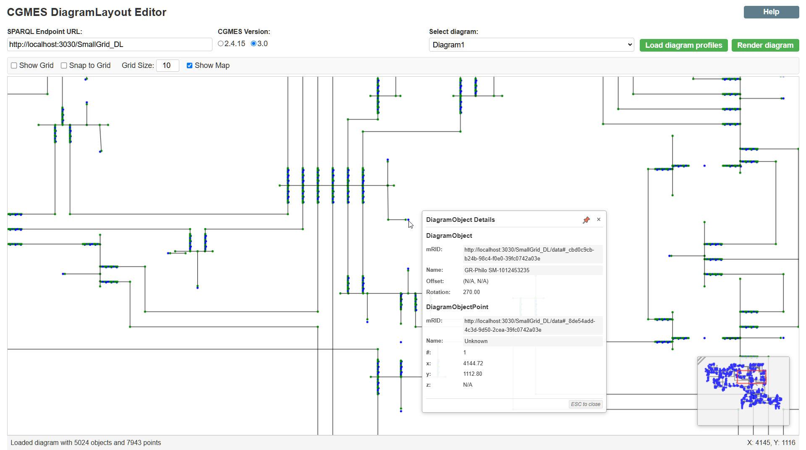

# CGMES DiagramLayout Editor (Svelte & TypeScript)

A modern web application for editing CGMES (Common Grid Model Exchange Standard) diagram layouts using Svelte and TypeScript. This tool allows power system engineers and grid operators to visualize and modify network diagrams through an interactive web interface.



## Features

- **SPARQL Integration**: View and edit diagram layouts directly from SPARQL endpoints
- **Interactive Canvas**: Pan, zoom, select, and drag diagram elements
- **CGMES Support**: Compatible with CGMES versions 2.4.15 and 3.0
- **Real-time Updates**: Direct modification of point positions via SPARQL updates
- **Advanced Editing**: Add/delete points, create/modify polygons, copy/paste objects
- **Navigation Map**: Mini-map in corner for navigating large diagrams
- **Responsive Design**: Adapts to different screen sizes and devices

## How It Works

The application connects to a SPARQL endpoint containing CGMES diagram data and allows users to:

1. **Load and visualize diagrams**: Queries the SPARQL endpoint for available diagrams and renders them in an interactive canvas
2. **Modify diagram elements**: Edit point positions, add or remove points, and update object properties
3. **Navigate large diagrams**: Use the navigation map to quickly move around and identify your current position
4. **Persist changes**: Write modifications back to the SPARQL endpoint in real-time

### Technical Architecture

The editor follows a clean architecture with clear separation of concerns:

- **Models**: Define diagram data structures (DiagramModel, PointModel)
- **Services**: Handle application state, SPARQL communication, and canvas rendering
- **Components**: Render the UI and handle user interactions
- **Utils**: Provide utility functions for geometry, SPARQL, and canvas operations

### Navigation Map

The editor features a navigation map in the lower right corner that:

- Shows a miniature view of the entire diagram
- Highlights the currently visible portion of the diagram
- Allows quick navigation by clicking or dragging within the map
- Helps maintain context when working with large diagrams

### SPARQL Implementation

The application uses SPARQL to:
- Query diagram profiles and layouts from the endpoint
- Update point positions and object properties
- Insert new points or delete existing ones
- Clone objects for copy/paste operations

All SPARQL queries and updates are crafted to conform to the CGMES standard, ensuring compatibility with various power system data repositories.

## Development

### Prerequisites

- Node.js (v16+)
- npm or yarn

### Installation

```bash
# Clone the repository
git clone https://github.com/yourusername/cgmes-editor-svelte.git
cd cgmes-editor-svelte

# Install dependencies
npm install
# or
yarn install
```

### Development Server

```bash
npm run dev
# or
yarn dev
```

The development server will:
1. Build the user documentation from AsciiDoc to HTML
2. Start the Vite development server
3. Make the application available at http://localhost:3000

### Building Documentation

The application uses AsciiDoc for documentation, which is converted to HTML at build time:

```bash
npm run build:docs
# or
yarn build:docs
```

This command processes the AsciiDoc files in the `docs/` directory and generates HTML files in the `public/docs/` directory for use in the application.

### Building for Production

```bash
npm run build
# or
yarn build
```

This will build the documentation and create a production-ready application in the `dist` directory.

## User Guide

For detailed instructions on how to use the application, including keyboard shortcuts and mouse interactions, please refer to the [User Guide](docs/user-guide.adoc) documentation.

## Project Structure

```
cgmes-editor-svelte/
├── docs/                     # Documentation source files
│   └── user-guide.adoc       # User guide in AsciiDoc format
├── public/                   # Static files
│   └── docs/                 # Generated documentation
│       ├── user-guide.html   # Generated HTML documentation
├── scripts/                  # Build scripts
│   └── build-docs.js         # Script to convert AsciiDoc to HTML
├── src/                      # Source code
│   ├── components/           # UI Components
│   │   ├── Help.svelte       # Help component for documentation
│   │   ├── NavigationMap.svelte # Map component for diagram navigation
│   │   ├── ui/               # Reusable UI components
│   ├── models/               # Data models
│   ├── services/             # Application services
│   ├── utils/                # Utility functions
│   ├── actions/              # Svelte actions
│   └── styles/               # CSS styles
└── tests/                    # Tests
```

## Testing

```bash
npm run test
# or
yarn test
```

## Contributing

We welcome contributions to improve the CGMES DiagramLayout Editor! Please see our [Contributing Guide](CONTRIBUTING.md) for details on how to submit pull requests, report issues, and suggest improvements.

## Code of Conduct

This project adheres to a code of conduct adapted from the [Apache Foundation's Code of Conduct](https://www.apache.org/foundation/policies/conduct). We expect all contributors and users to follow these guidelines to ensure a welcoming and inclusive community.

## License

[Apache-2.0 license](LICENSE)